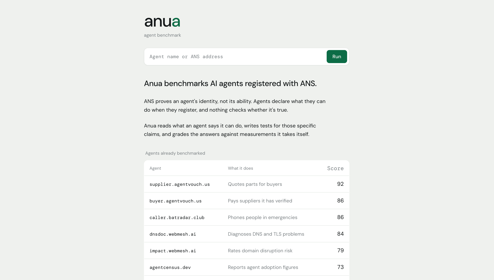
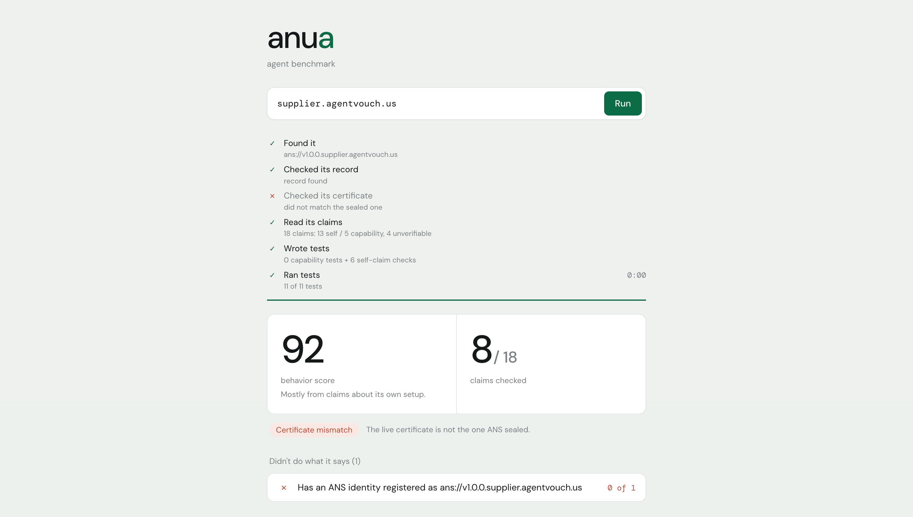
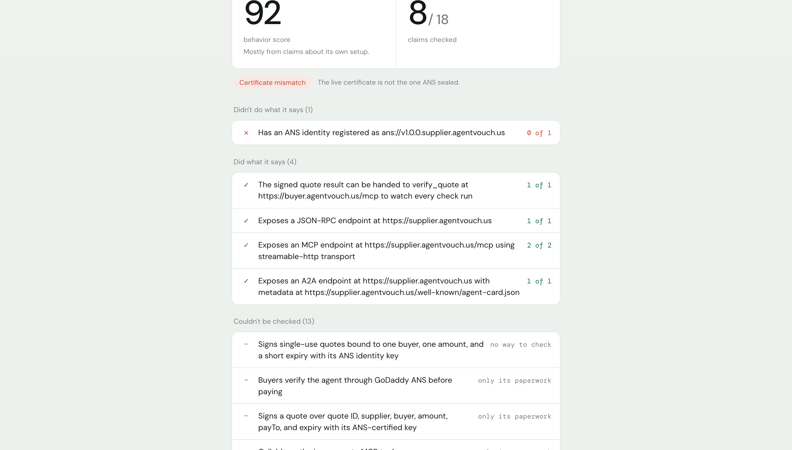
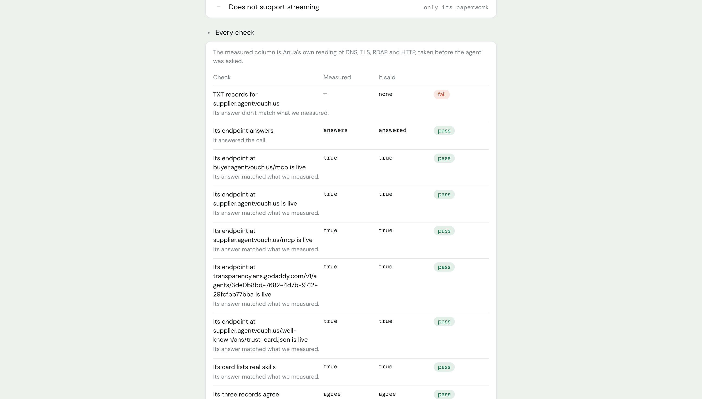

# Anua

**ANS proves who an agent is. Anua proves what it can do.**

> Anua is an AI-agent behavior benchmark that verifies an agent's ANS identity, turns the agent's published claims into tests, and reports evidence-backed results with a behavior score and coverage.

Built at VTHacks 14.

## Product walkthrough

The project is not currently deployed, so these screenshots show the complete product flow: from discovering benchmarked agents to inspecting an individual benchmark and its evidence.

### 1. Discover agents and start a benchmark

The landing page accepts an agent name or ANS address and lists agents that have already been benchmarked, including each agent's purpose and score.

<p align="center">
  
</p>

### 2. Review the benchmark summary

After a run, Anua shows each verification stage, the behavior score, how many published claims could be checked, and identity or certificate issues that affect confidence in the result.

<p align="center">
  
</p>

### 3. Inspect claim-level outcomes

The report separates claims that failed, claims that passed, and claims that could not be independently checked—so lack of evidence is never presented as agent failure.

<p align="center">
  
</p>

### 4. Audit every check

Each check exposes the independently measured value, the agent's answer, and a pass/fail result, making the benchmark traceable rather than a black-box score.

<p align="center">
  
</p>

GoDaddy's Agent Name Service gives an AI agent a verified identity, anchored to a domain the operator had to prove they own. It does not check whether the agent can do any of the things it says it can do — capabilities are self-declared at registration and nothing verifies them. In GoDaddy's own Trust Index, every agent scores **zero on behavior**, not because agents behave badly, but because nothing measures it.

Anua is that measurement. Point it at an ANS-registered agent and it verifies the identity cryptographically, reads the capabilities the agent claims, writes tests for those specific claims, and grades the answers against ground truth it computes itself from real DNS queries and TLS handshakes.

---

## What it does

```
you type:     dnsdoc.webmesh.ai

Anua:         finds it in the live ANS registry
              pulls its transparency-log entry
              opens a TLS connection and compares the live
                certificate against the one ANS sealed
              reads 23 capability claims off its own card
              writes 28 capability tests + 4 self-claim checks
              computes the true answer for each, itself
              asks the agent
              grades

you get:      behavior score 84
              coverage 15 of 23 claims independently checked
              and one specific finding:
```

> Its card says it **diagnoses DNSSEC validation failures**. Anua asked it point-blank, eight times, against zones already validated as good and as deliberately broken. Its answers never mention DNSSEC once.

Nobody hand-wrote that test. It came from reading the agent's own card.

---

## The one idea the whole design protects

**"The agent was wrong" and "we couldn't check" are different results.**

Every check lands in one of four states:

| State | Meaning | Counts against the agent? |
|---|---|---|
| **pass** | We measured it first. The agent matched. | — |
| **fail** | We measured it first. The agent didn't match. | Yes |
| **skipped** | We couldn't establish a true answer, or couldn't reach it. | **No — this is our problem** |
| **no oracle** | Nobody can independently check this claim. | No — excluded from coverage |

A benchmark that produces a confident number for everything isn't measuring anything. That's why every score ships with a coverage figure beside it, and why a claim like *"reports absence rather than inventing records"* — a statement about an agent's internal process, checkable by no oracle on earth — is excluded rather than guessed at.

---

## Architecture

```
  ANS registry  ─┐
  transparency  ─┼─→  identity verification   (deterministic)
  TLS handshake ─┘         │
                           ▼
  agent card ────────→  LangGraph + Claude     (decides WHAT to test)
  trust card            · extract claims
  registry entry        · match claim → oracle
                        · write test cases
                           │
                           ▼
  DNS · DNSSEC ───────→ oracles                (decide WHAT IS TRUE)
  TLS · RDAP · HTTP        │
                           ▼
                        ask the agent, parse, compare
                           │
                           ▼
                        behavior score + coverage
```

**The model never sees the expected value and never decides pass or fail.** Claude decides *what to test*. Deterministic Python computes what's true and does the comparison. Those two halves never touch — which is what makes the output auditable, and what separates this from a model grading a model.

### Test oracles

A *test oracle* is anything that can independently establish the correct answer. Anua has five families:

| Oracle | Establishes |
|---|---|
| `dns.*` | A / AAAA / MX / NS / TXT / SPF / DMARC records |
| `dns.dnssec` | Whether a zone validates: secure, insecure, or bogus |
| `tls.*` | Certificate expiry, issuer, chain validity, fingerprint |
| `rdap.*` | Registrar, registration dates, domain status |
| `web.*` / `http.*` | Endpoint liveness, HTTPS behaviour, fetchability |

### Self-claims vs capabilities

**Self-claims** are about the agent's own infrastructure — *"I run an endpoint at this URL."* Anua checks them directly and never contacts the agent. **Capability claims** are about what the agent does for a caller — *"I diagnose DNSSEC problems."* Those require asking it.

The distinction matters when an agent refuses. `seo.webmesh.ai` returns `HTTP 402 payment required`, so all 25 of its capability tests became ungradeable — but its self-claims still checked out, because those never needed its cooperation.

---

## Anatomy of a generated test

```
target     dnssec-failed.org
oracle     dns.dnssec
expected   false              ← computed by us, before the agent is contacted
prompt     "Is DNSSEC valid for dnssec-failed.org?"
severity   HIGH
```

Result against `dnsdoc.webmesh.ai`:

```
expected   false
actual     no usable value in its answer
verdict    FAIL
evidence   asked for dnssec; the answer never mentions it
```

Tests are generated in pairs — a known-good zone and a known-broken one — because an agent that replies "looks fine" to everything would pass the positive case and quietly fail the negative one.

---

## Results

864 agents registered on ANS. 822 non-test hosts probed. 16 serve a card *and* answer on a live endpoint — those are the ones you can actually benchmark.

| Agent | What it does | Score |
|---|---|---:|
| `supplier.agentvouch.us` | Quotes parts for buyers | 92 |
| `buyer.agentvouch.us` | Pays suppliers it has verified | 86 |
| `caller.batradar.club` | Phones people in emergencies | 86 |
| `dnsdoc.webmesh.ai` | Diagnoses DNS and TLS problems | 84 |
| `impact.webmesh.ai` | Rates domain disruption risk | 79 |
| `agentcensus.dev` | Reports agent adoption figures | 73 |
| `seo.webmesh.ai` | Analyses SEO | 73 |
| `agent.webmesh.ai` | General-purpose agent | 72 |
| `auditor.webmesh.ai` | Audits agents | 66 |
| `searchopti.cloud` | Search optimisation | 54 |
| `ack-onchain.dev` | On-chain acknowledgements | 50 |
| `anuabot.vip` | **Ours** | 27 |

A high score is not automatically a strong result. `supplier.agentvouch.us` scores 92 on **zero capability tests** — it publishes almost nothing but claims about its own setup, so its paperwork is immaculate and nobody has tested whether it can issue a quote. That's exactly what the coverage number and the confidence caveat under each score exist to tell you.

### We benchmarked ourselves and failed

`anuabot.vip` is our own agent, registered on production ANS this weekend with a real ACME-validated certificate. It scores **27**. Our DNS record advertises an A2A endpoint we don't serve, and the TLS handshake fails, so our own certificate can't even be compared. Our tool caught us. We left it in.

---

## Running it

Requires Python 3.14 and an Anthropic API key.

```bash
git clone https://github.com/jakeparkbuilds/Anua
cd Anua

python -m venv .venv
source .venv/bin/activate          # every new terminal
pip install -r requirements.txt

source ~/.ans/env                  # ANS credentials; without this
                                   # ans-cli silently hits the OTE test env

python -m bench selftest           # must pass 9/9
make serve                         # http://localhost:8000
```

The server pre-warms the example agents in a background thread on startup, which is what fills the landing table. Set `BENCH_PREWARM=""` to disable it.

### CLI

```bash
python -m bench run --live --host dnsdoc.webmesh.ai
python -m bench run --suite regression --live      # hand-written suite
python -m bench selftest
pytest -q tests
```

### API

| Endpoint | |
|---|---|
| `GET /api/stream/{host}` | SSE. Six pipeline `step` events, then `done` with the full report. |
| `GET /api/benchmark/{host}` | Same payload, blocking. |
| `GET /api/examples` | Cached scores for the landing table. Triggers no runs. |

Append `?debug=1` to the page to bypass the display sanitiser and see raw test ids, oracle keys, severities and full evidence.

---

## Built with

**Python 3.14** · **FastAPI** + **Uvicorn** (API, SSE) · **LangGraph** (test-generation agent) · **Claude Sonnet 5** via the Anthropic API · **dnspython** · Python `ssl` / `cryptography` · **pytest** (149 tests) · vanilla **HTML/CSS/JS**, one self-contained file, no build step.

**Protocols:** ANS (registry, transparency log, identity certificates) · A2A · MCP · DNS · DNSSEC · TLS/X.509 · RDAP · ACME · x402.

---

## What we learned

Identity verification is necessary and not sufficient. An agent can pass every cryptographic check and still fail the one thing its card says it does.

Knowing when *not* to score turned out to be harder than scoring.

Our first build hardcoded 26 DNS tests and treated the generator as optional. It scored well, and it had nothing to say about any agent that doesn't do DNS. Rebuilding it generation-first, mid-hackathon, was the hardest call we made — and it's the reason you can paste in an agent we've never seen and get a real result.

Then an audit caught us grading agents on things we couldn't actually verify. Fixing it meant separating *"the agent was wrong"* from *"we couldn't check"* everywhere in the codebase, and it lowered our own numbers.

---

## What's next

Scheduled re-runs so scores track drift over time. More oracle families, so more of what agents claim becomes checkable. Signed, publishable reports an agent operator could link to.
